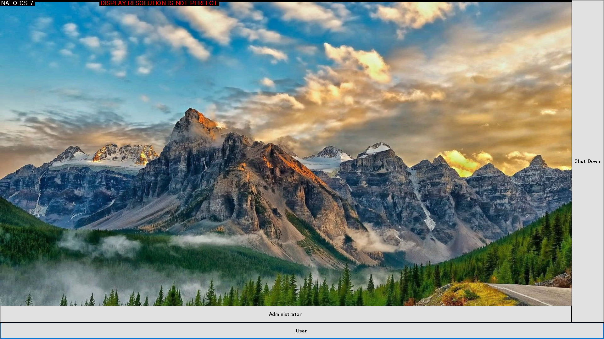
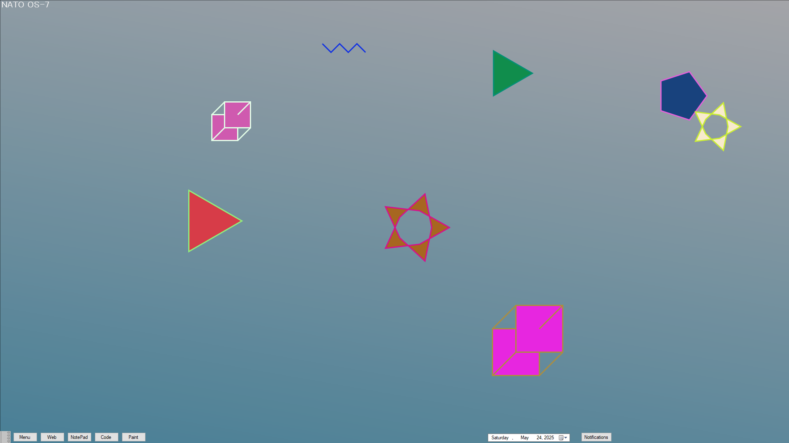

# NATO-OS 7 🚀

Welcome to **NATO-OS 7**, a custom-built operating system project crafted in pure C#. This isn’t your average OS — it’s a passion project turned powerhouse, loaded with 60+ apps, 100+ features, and designed to deliver a full desktop experience inside a Windows environment. Built by one dev, for the culture.

## 📸 Screenshots

<div align="center">
  
  <p><em>Lock Screen</em></p>
</div>
<div align="center">
  
  <p><em>Desktop</em></p>
</div>

## 🎨 Features

- 🖥️ Custom desktop UI with icons, windows, and taskbar
- 📦 60+ built-in apps ranging from media players to system utilities
- 🛠️ App launcher, file manager, and settings system
- 🎨 Paint app (NATOPaint)
- 📑 Text editor
- 📡 Chat app with private messaging & file sharing
- 🎮 Retro games & arcade-style minigames
- 📊 System stats monitor
- 🎧 Music and video player
- 💾 App installer for new apps
- 🖥️ 3D Desktop Environment (optional)
- and way more…

## ⚙️ Tech Stack

- Language: **C#**
- Framework: **.NET Framework / WinForms**
- Database: **SQL Server (for chat, user data, etc.)**
- Networking: **TCP-based communication for messaging apps**
- Graphics: **Custom WinForms rendering and OpenTK for 3D**

## 📂 Project Structure

```plaintext
/NATO-OS 7               --> All built-in applications / Core Files
/server               --> OS Server Files
/README.md          --> This file
